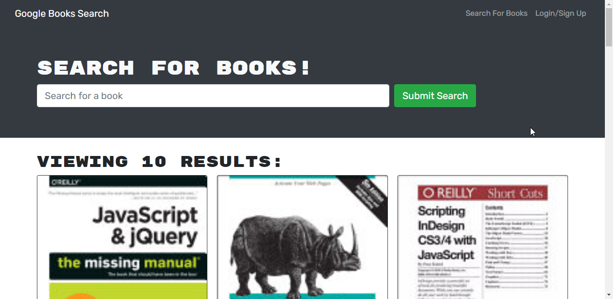
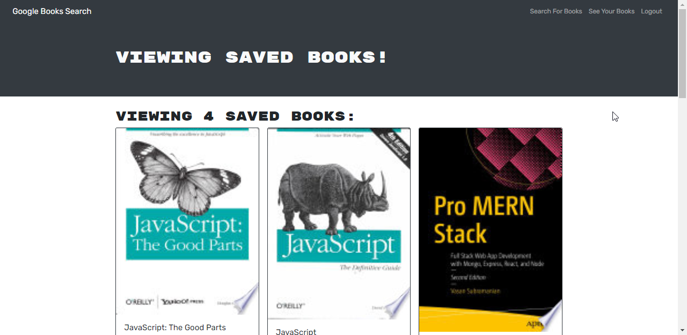
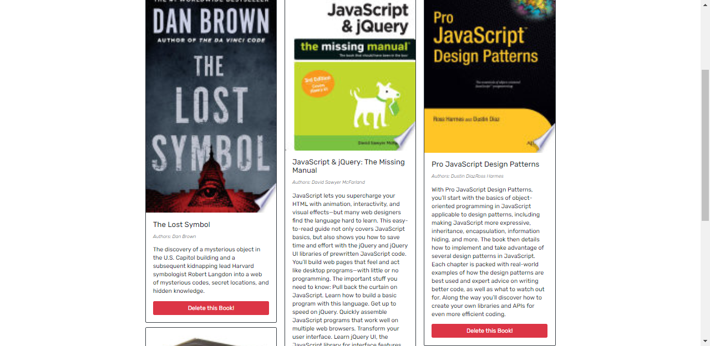

# Book Search Engine  

This project was bootstrapped with [Create React App](https://github.com/facebook/create-react-app).
 
  ## Description 

  A Google Books API search engine built with a RESTful API, and refactor it to be a GraphQL API. Built with Apollo Server.
  Where users can search for books and saved them in their accounts.
  
  

  ## Table of Contents 
  * [Application](#Application)
  * [Features](#Features)
  * [License](#license)
  * [Contributing](#contributing)
  * [Questions](#questions)
  

  ## Application

  To go to the deployed application go to:
https://awesome-reading.herokuapp.com/

  ## Features

  * Search Books, 

* Login or Signup:

* Save Books:

* Remove Books:

  ## License

    Copyright © 2020 florhaidee. 
    Licensed under the MIT to see more about this license you can find it on the file 'license.txt' go to [MIT-license](LICENSE) 

  ## Contributing 

    Please note that this project is released with a Contributor Code of Conduct. By participating in this project you agree to abide by its terms.
    Visit:
https://www.contributor-covenant.org/version/2/0/code_of_conduct/ to have more information.

    To contribute 
     * Add an issue
     * Create a new branch with format-name: 
        - (feature/name/your-name) or (bug/name/your-name) 
     * Make a pull request.

  ## Questions

    If you have more questions about this application, you can contact me by:
      email: florhaideeg@gmail.com
      GitHub username: florhaidee

  ## ©️2020  Made by florhaidee
